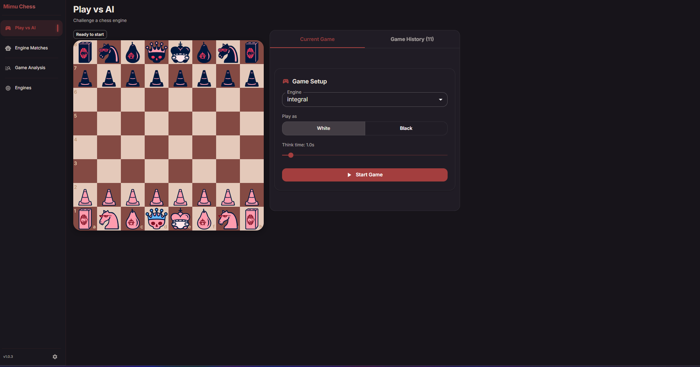
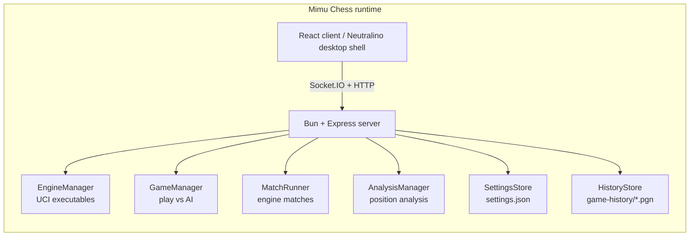

# Mimu Chess

Desktop chess for people who run real UCI engines.

Play against an engine, run engine-vs-engine matches, review saved PGNs, and analyze positions in one client.

<p align="center">
  <a href="./LICENSE"></a>
  
  
  
</p>

<p align="center">
  
</p>

## What It Does

- Play as White or Black against a UCI engine
- Run multi-game engine-vs-engine matches with live eval, depth, PV, nodes, and NPS
- Save finished games as PGN in the game history folder
- Reopen saved games and analyze any position with a selected engine
- Work in desktop mode for the full file and engine flow, or browser dev mode for UI iteration

## How The Client Works



## Quick Start

```bash
bun install
bun run desktop:dev
```

Browser-only development:

```bash
bun run dev
```

Build the app:

```bash
bun run build
bun run desktop:build
```

## Typical Workflow

1. Install dependencies with `bun install`.
2. Start the app with `bun run desktop:dev`.
3. Add a UCI engine in `Engines`.
4. Use `Play vs AI`, `Match`, or `History / Analysis`.
5. Reopen saved PGNs from history when you want to review or analyze a game.

## Engine Support

Mimu Chess is built for UCI executables, including setups that need an extra weights file such as LC0 or Maia-style engines.

## Data Files

Saved files live in the app config directory:

- Windows: `%APPDATA%\Mimu Chess`
- macOS: `~/Library/Application Support/Mimu Chess`
- Linux: `$XDG_CONFIG_HOME/mimu-chess` or `~/.config/mimu-chess`

Key files:

```text
engines.json
settings.json
game-history/
```

## Project Layout

```text
client/                    React frontend
server/                    Local backend and engine integration
scripts/                   Desktop packaging helpers
dist/                      Built frontend and desktop assets
neutralino.config.json     Neutralino desktop config
CONTRIBUTING.md            Development guide
```

## Stack

- `client`: React 19, TypeScript, Material UI, `react-chessboard`
- `server`: Bun, Express, Socket.IO, `chess.js`
- `desktop`: Neutralino

## Contributing

Development details live in [CONTRIBUTING.md](./CONTRIBUTING.md).

When reporting issues, include your OS, the engine you tried to run, and whether the problem happens in `bun run dev`, `bun run desktop:dev`, or both.

## License

[GPL-3.0](./LICENSE)
