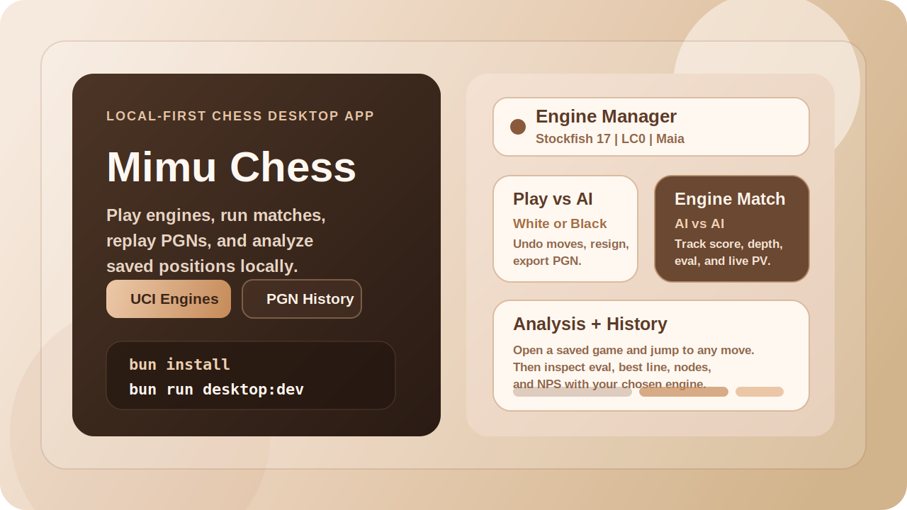
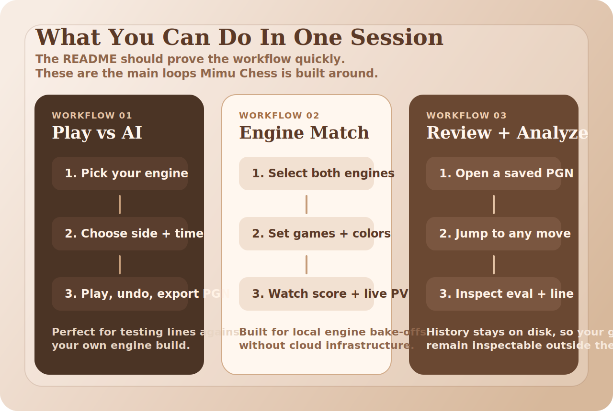
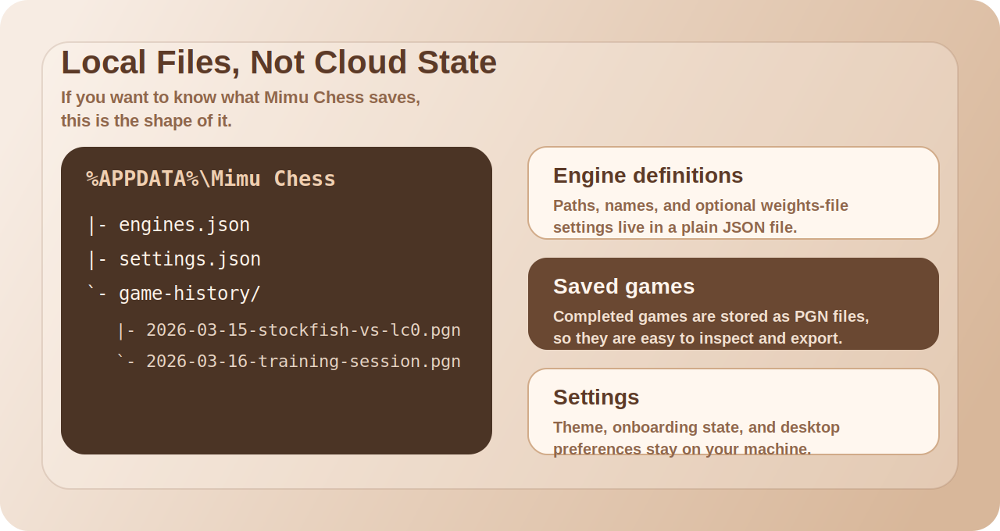

# Mimu Chess

<p align="center">
  
</p>

<p align="center">
  <strong>Local-first chess for people who run real UCI engines.</strong><br/>
  Play against an engine, run engine matches, replay PGNs, and analyze saved games without shipping your files to a server.
</p>

<p align="center">
  <a href="./LICENSE"></a>
  
  
  
</p>

## Why Star This Repo

You can see what the app is for in a few seconds:

- Local UCI engine play, not a browser toy.
- AI vs AI matches with live engine output.
- PGN-backed history you can inspect outside the app.
- Built-in analysis for saved games.
- Desktop-first workflow, with browser dev mode available for iteration.

## Show, Don't Tell

<p align="center">
  
</p>

### Start It In Two Commands

```bash
bun install
bun run desktop:dev
```

### Build It

```bash
bun run build
bun run desktop:build
```

If you only want browser-style UI development:

```bash
bun run dev
```

## What You Get

### Play against a local engine

```bash
# dev mode
bun run dev
```

- Pick an engine.
- Choose White or Black.
- Set think time.
- Flip the board, undo moves, resign, and export the game as PGN.

### Run engine-vs-engine matches

```bash
# desktop mode is the most representative environment for file + engine workflows
bun run desktop:dev
```

- Select two configured engines.
- Run multi-game matches with alternating colors.
- Watch score, depth, eval, PV, nodes, and NPS while the match is running.
- Save completed games into local history for later review.

### Review and analyze saved games

```text
History -> pick a saved PGN -> jump to any move -> Analysis -> choose engine
```

- Replay saved games move by move.
- Analyze the current position from any ply.
- Inspect evaluation, best move, and principal variation from your selected engine.

## How To

This is the section most people actually need.

### 1. Install dependencies

```bash
bun install
```

Requirements:

- [Bun](https://bun.sh/)
- At least one local UCI engine executable
- `bun install` from the repo root so the local Neutralino CLI is available

### 2. Run the app

```bash
# browser-style development
bun run dev

# desktop development
bun run desktop:dev
```

### 3. Add an engine

```text
Open Mimu Chess -> Engines -> Add Engine -> choose executable -> save
```

Supported workflow details:

- Standard local UCI executables.
- Engines that need a weights file, such as LC0 or Maia.
- Path validation before saving.

### 4. Play against the engine

```text
Play vs AI -> choose engine -> pick side -> set think time -> Start Game
```

You can then:

- make moves on the board
- undo
- flip the board
- resign
- export PGN

### 5. Run an engine match

```text
Match -> choose Engine A + Engine B -> set number of games -> Start Match
```

The app will:

- alternate colors across games
- show the current board live
- track score across the match
- save finished games into history

### 6. Analyze a saved game

```text
History / Analysis -> open a saved game -> step to a position -> choose engine -> analyze
```

Use this when you want:

- a quick post-game check
- engine feedback on a specific position
- a reusable PGN archive on disk

## Local Files

<p align="center">
  
</p>

Mimu Chess stores configuration and saved games in the local app config directory.

- Windows: `%APPDATA%\Mimu Chess`
- macOS: `~/Library/Application Support/Mimu Chess`
- Linux: `$XDG_CONFIG_HOME/mimu-chess` or `~/.config/mimu-chess`

Important files:

```text
engines.json      # saved engine definitions
settings.json     # theme + desktop settings + onboarding state
game-history/     # saved PGN files
```

## Project Layout

```text
.
|- client/                  React frontend
|- server/                  Local backend and engine integration
|- scripts/                 Desktop packaging helpers
|- dist/                    Built frontend / desktop assets
|- neutralino.config.json   Desktop app config
|- CONTRIBUTING.md          Development guide
`- package.json             Workspace scripts
```

## Stack

- `client`: React 19, TypeScript, Material UI, `react-chessboard`
- `server`: Bun, Express, Socket.IO, `chess.js`
- `desktop`: Neutralino

## FAQ

### Where are my games saved?

As PGN files in the local app config directory, under `game-history/`.

### Does this require an online account?

No. The core workflow is local-first.

### Can I use LC0 or Maia-style setups?

Yes. The engine manager supports engines that require a weights file.

### What should I do if an engine is not starting?

Check the executable path first in the Engines view. If the same problem comes up more than once, it belongs in this README or [CONTRIBUTING.md](./CONTRIBUTING.md).

## Contributing

If you open an issue, include:

- your OS
- the engine you tried to run
- whether the problem happens in `bun run dev`, `bun run desktop:dev`, or both
- the exact step that failed

Development and packaging details live in [CONTRIBUTING.md](./CONTRIBUTING.md).

## License

[GPL-3.0](./LICENSE)
